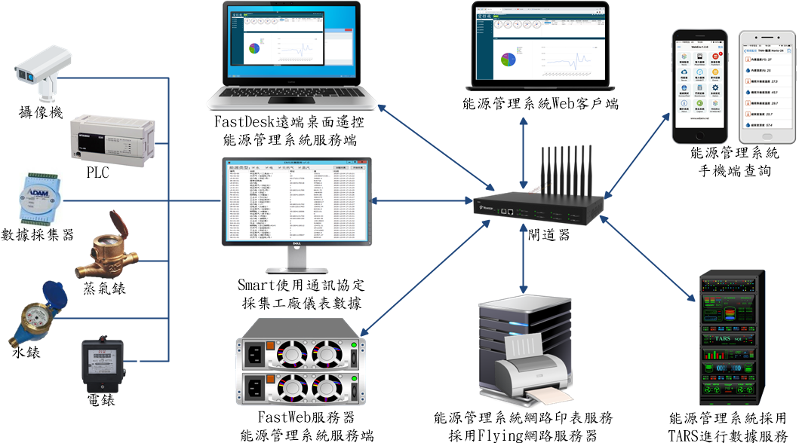
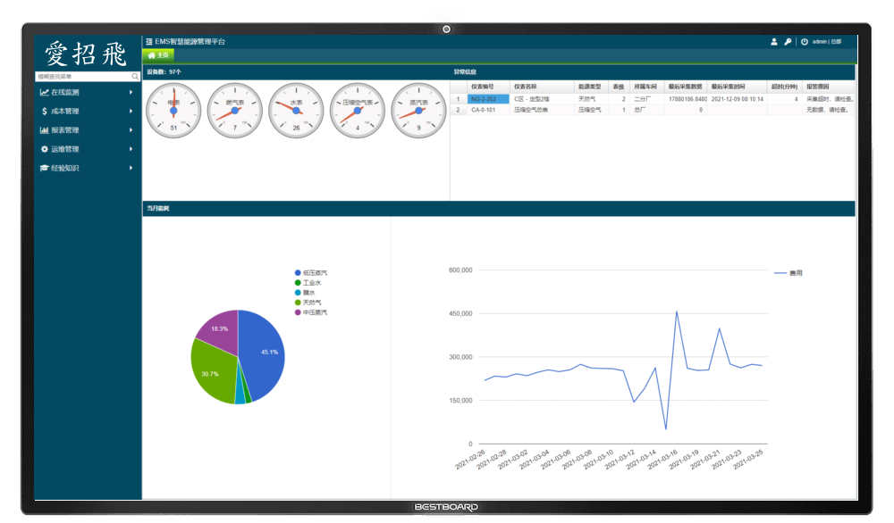
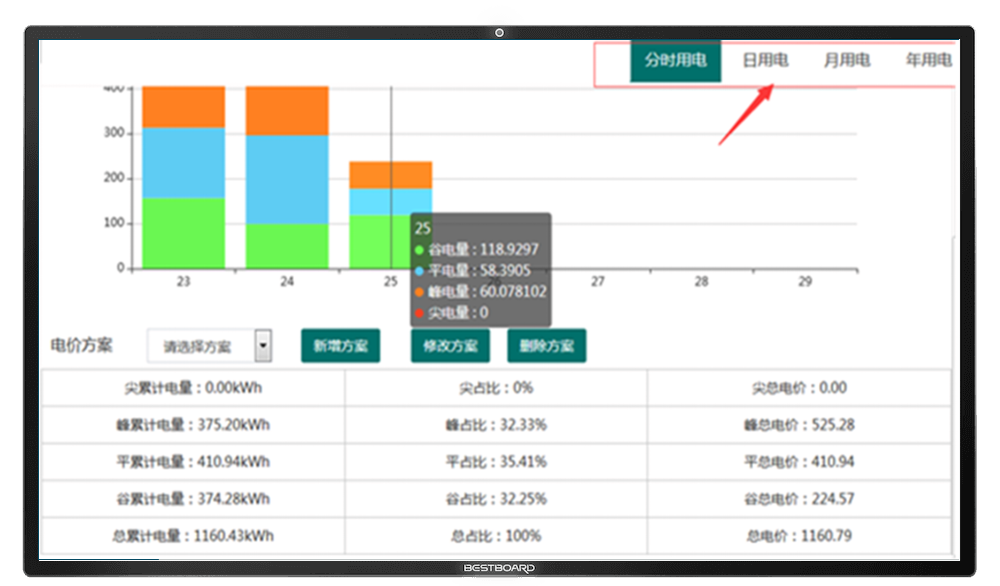
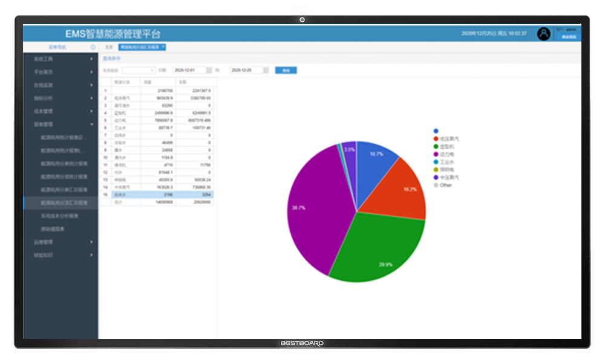
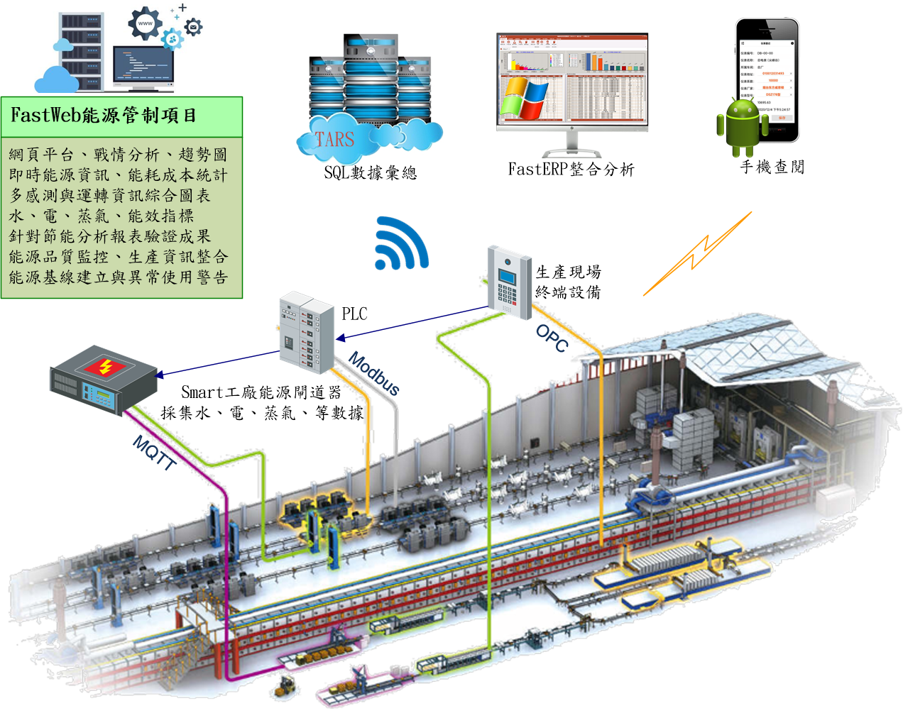
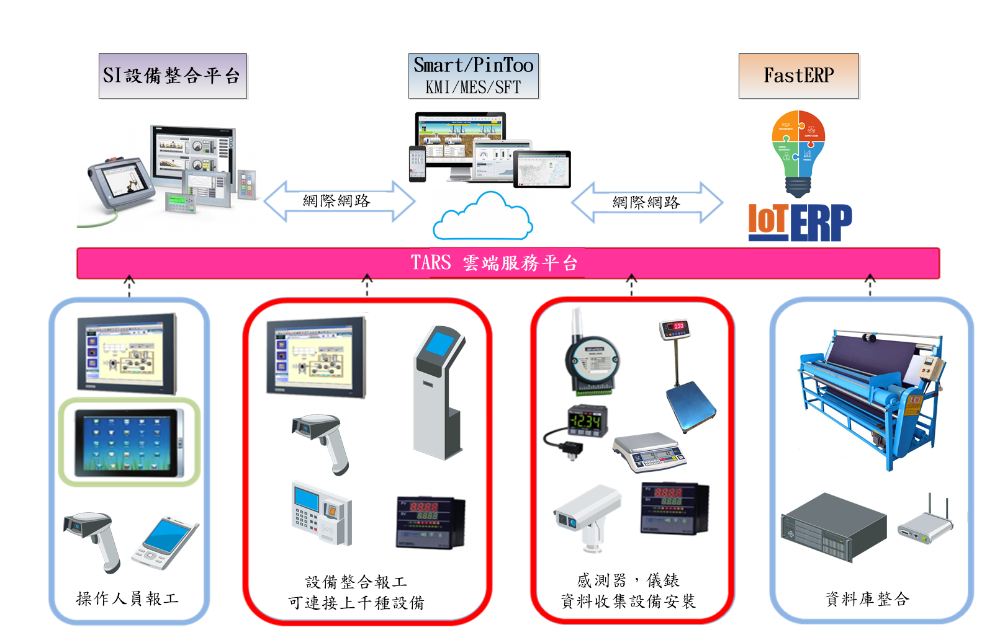
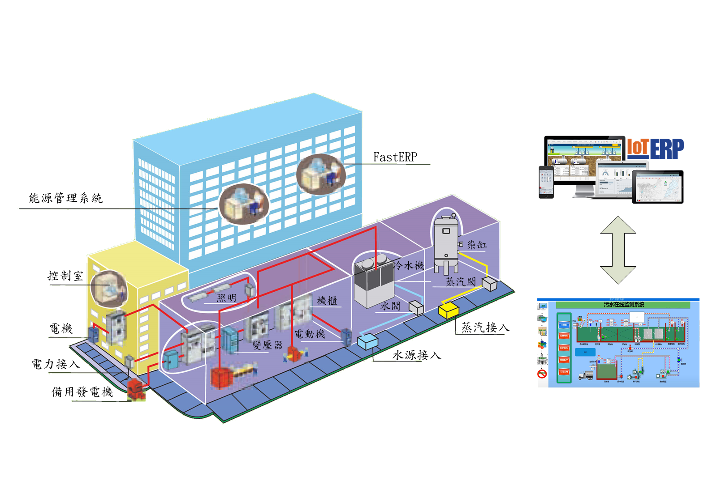

# 能源管理 energy_management
以儀錶採集為基礎，選用TARS作為企業級生產資料平臺，採用先進、實用、有效的專業計算方法，實現整個企業生產資料即時採集和資訊共用。實現電力、燃氣、水等各類能耗的分類和分項資料的採集、線上監測和趨勢分析等功能，對整體能耗狀況進行統一監測管理；通過網際網路與ERP系統聯結，為節能管理和節能改造提供基礎數據。

> **加入 Facebook 社團**
>
> [https://www.facebook.com/groups/isoface/](https://www.facebook.com/groups/isoface/)
> 
> **點讚追蹤 Facebook 粉絲專頁**
> 
> [https://www.facebook.com/AIOT.ERP](https://www.facebook.com/AIOT.ERP)

## 能源管理與工業物聯網整合

能源是工廠生產不可或缺的基本要素。隨著能源日益緊張和環境惡化，獲得經濟方便環保的能源變成工廠生存與可持續發展的急迫問題，尋找提高能源利用效率的解決之道，成為企業應盡的責任。各類水、電、氣設備與能耗是工廠日常運營成本的主要構成部分之一，合理的能源管控功能可以顯著提高設施與能源利用效率並降低成本。

愛招飛能源管理系統，以儀錶採集為基礎，選用TARS作為企業級生產資料平臺，採用先進、實用、有效的專業計算方法，實現整個企業生產資料即時採集和資訊共用。

採用愛招飛能源管理系統，可實現企業與電力、燃氣、水等各類能耗的分類和分項資料的採集、線上監測和趨勢分析等功能，對整體能耗狀況進行統一監測管理；通過網際網路與ERP系統聯結，為節能管理和節能改造提供基礎數據。

愛招飛能源管理系統採用現場匯流排測控網路連接電力、燃氣、水等各類能耗系統，通過安裝在各能耗系統上的智慧電錶、智慧燃氣表、智慧水錶、數位流量計等智慧測量裝置將電量、水耗量、燃氣量、集中供熱耗熱量、集中供冷耗冷量、其它能源應用量等能耗資料送到位於中央控制室的系統管理控制電腦，從而實現整個廠區的能耗資料的採集、存儲和分析等。

愛招飛能源管理系統，還包括：能耗狀況線上監測、能耗趨勢分析管理、能耗成本分攤分析等增強功能。

## 系統架構特色

* 使用愛招飛軟體開發工具設計，服務端採用FastWeb，客戶端與手機端採用 Web 瀏覽器。
* 採用愛招飛軟體工具 TaskRuner，監管有能源管理系統服務端相關應用程序運行狀況。如遇突發狀況，立即發送警訊通知管理人員。自訂處理程序，例如關閉運行程序、重啟..，自動解決繁雜的意外狀況。
* 操作問題，使用愛招飛軟體工具FastDesk，通知管理人員進行遠端桌面遙控，快速解決疑惑。
* 使用愛招飛軟體工具 Flying，協助源管理系統，無論在客戶端、手機端，都可使用便捷的網路印表服務。
* 紡織印染廠的動力需求包括水、電、水蒸氣..，使用愛招飛軟體Smart採集儀表數據，並進行各種多元的統計分析與成本運算，是企業主經營判斷的重要依據。
* 整合網路攝影機，監控印染廠、辦公室，確保人員與設備的安全。
* 印染廠其它任何產業需求，都可使用愛招飛軟體開發工具進行擴展。

## 產業運用特色

* 生產過程即時監測：
    
    對生產現場的即時情況進行即時監測，即時查詢現場工藝流程圖、即時趨勢和歷史趨勢、報警資訊等，所有的即時資料都採集到資訊中心的TARS即時資料庫伺服器中，在公司局域網上發佈生產現場的料，具有相應許可權的使用者可以在局域網內流覽生產現場的即時資料，系統自動生成相關的資料統計報表。

* 生產指標監測：

    對採集的資料進行分析整理，把現場採集的實際資料與相關的生產指標項目進行對比，偏差過大時進行報警並記錄。還可以結合企業的實際需求開發一些實用功能。

* 為企業存儲長期的歷史資料：

    即時資料庫可用於生產過程資料的自動採集、存儲和監視，可線上存儲多年歷史資料，並提供了用戶端資料展示手段。即時資料庫對於企業來說就如同飛機上的“黑匣子”。由於企業即時資料存放在統一的資料庫中，企業中的所有人，無論在什麼地方都可看到和分析相同的資訊，用戶端的應用程式可使使用者很容易在企業級實施管理，諸如工藝改進、品質控制、故障定位維護等。通過即時資料庫可集成現有的ERP等應用系統，在業務管理和即時生產之間起到橋樑作用，更好地實現企業數位化管理。

## 能源管理系統的功能

* 系統功能
    
    數據中心―查看整個平臺的報警，故障，接入設備，能源耗用的宏觀資料。能耗與ERP資料對比分析等。

    車間看板―展示車間產量、能耗資料、能耗點比等直觀資料，同時根據系統資料許可權設置實現各車間資料過濾

* 線上監測

    表級數據檢核―平臺已經接入了的儀錶層級關係。即時反應即時用量，累計用量，日耗用量等資料，並可以直觀的反應出層級之間資料對比損耗情況

    採集資料查詢―依據所選儀錶條件與時間段，快速查找所選時間段的耗能情況。

    即時資料監測與收發器檢測―依據所選儀錶查找即時累積資料。收發器檢測

    能耗分析―對用能的分析，可根據不同的費率方案來預測，使用能耗，日用能耗，月用能耗，年用能耗。

    報警分析―記錄儀錶的報警，包含，流量、溫度、速度等越線報警；其他報警。記錄報警的的總數和類別。

    能耗關聯―在相同生產現場，於同時間點上相對應的資料（包含水，電，蒸汽，天然氣）線性對比分析。

* 指標分析

    能效排名―車間多個設備能耗按能源類型的排名。

    能源品質―通過監測能源計量儀錶的參數，如：蒸汽的溫度、壓力、速度，天然氣的壓力等參數，分析能源的品質狀況。

* 成本管理

    成本項目―成品專案就是按照財務科成本報表中的明細專案轉換成基礎資料的管理模組，成本核算時，系統會將獲取到的資料分類到各個成本專案中，達到成本核算分項統計的目的。

    能源單價―用來維護各能源類型的單價資訊，可以指定單價的時間段，因為每一個階段的單價會有所不一樣，能源單價在成本核算過程需要使用到。

    採集核算―負責將自動採集和手工錄入的儀錶資料，按班組時間段進行計算，獲取當期班組所涉及到的每個儀錶的能源耗用資料，此資料為後面成本核算的資料來源。

    獎罰登記―管理人事獎罰相關內容的記錄，資料匯總到成本表中。

    成本核算―核算各能耗單元（車間）的用能和ERP業務發生情況，各項資料均會按照‘成本專案’功能定義好的項目進行匯總。

* 報表管理

    能源耗用統計報表―記錄車間的能源消耗。主要有“日報表”，“月報表”，“年報表”。

    能源耗用統計報表―展示各儀錶採集的能耗資料，報表自然月形式展示資料。 

    能源耗用分類統計報表―記錄車間的各儀錶所屬能源分類的耗用。

    能源耗用分項統計報表―記錄車間的各儀錶所屬能源分項的耗用。

## 能源管理系統與ERP管理系統整合

愛招飛能源管理系統連接底層的硬體，既可通過類比訊號，向現場生產控制系統提供能耗參數，也可通過服務器向生產控制系統提供數據資料，極大簡化現場能耗資料採集、接線，並優化生產控制對能耗參數的要求，在節省控制系統資料採集和控制部分的硬體投資的同時，可以減少後續使用維護成本和工作量。同時又能與ERP MRP-II MES CIMS 的資料交互。它的開放性和相容性保證可方便的接入其它系統，包括通過乙太網接入ERP/MRP-II/MES 或CIMS 等。

為更加充分的利用所採集的能源即時資料，實現生產過程和生產管理資訊的整合，需要實現採集即時資料庫和關聯式ERP資料庫中的資料整合。把即時資料庫中經過運算、匯總資料輸出到關聯式資料庫中，從而實現與管理資料庫的集成，為企業的上層管理提供可靠的資料基礎。除了採集即時資料，還可包括： 組態內容，即時資料，統計資料，報警，事件，操作等資訊。

能源管理系統通過以下兩種方式存儲資料：

* 專門的資料存儲程式：該程式可以將資料按指定的週期進行存儲，存儲的點、資料庫、表結構可以靈活指定。
* 通過即時資料庫SQL腳本來實現。該方法自由、靈活，但是需要較多的腳本程式設計。

## 能源管理系統作業方式

* 建立公司的即時歷史資料平臺：對生產運行資料、設備資料等資訊進行收集、存儲和查詢分析。
* 提供分析手段：對生產資料和相關的資訊建立生產資訊資料倉庫；通過豐富的統計分析方法和手段對資料進行展示。
* 運行模式：系統運行模式為C/S結構，只要安裝使用者端軟體即可使用。

